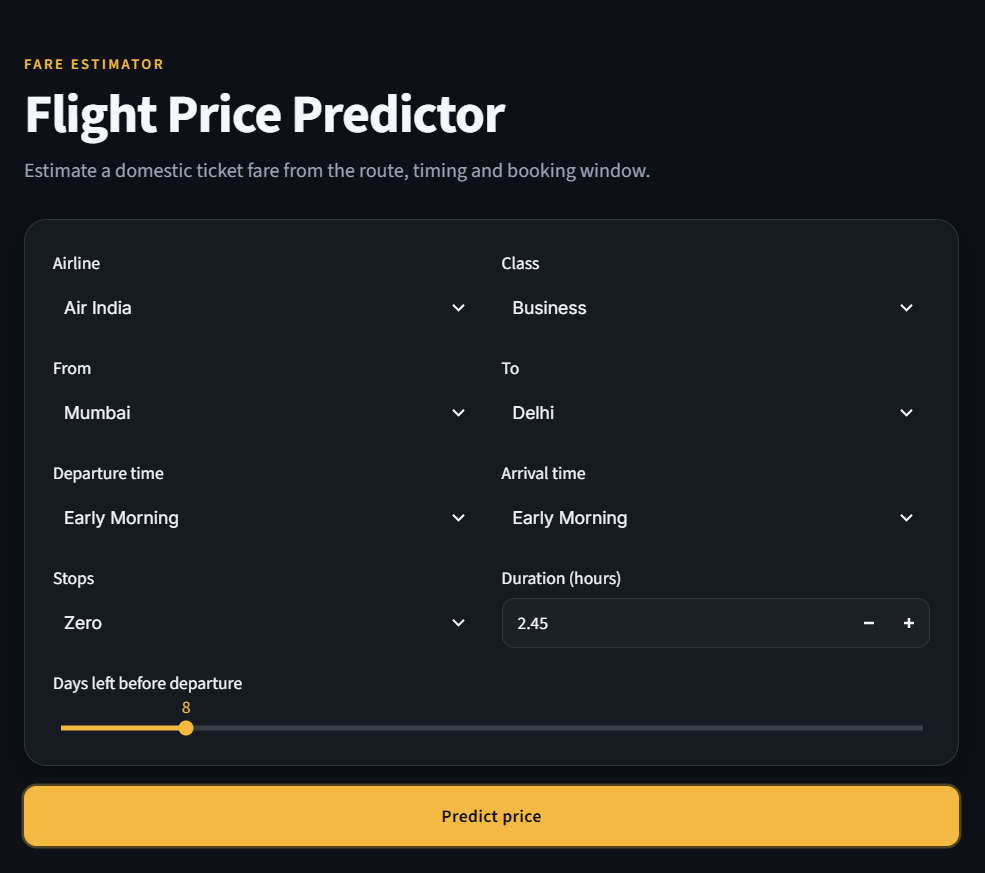
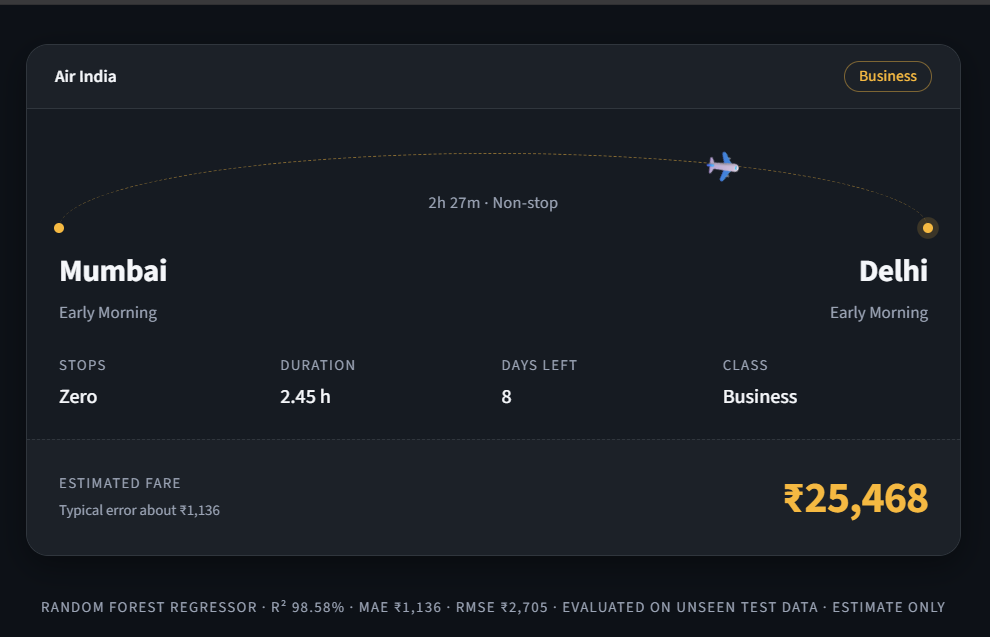

# ✈️ Flight Price Predictor

A machine learning web app that estimates domestic flight ticket prices in India from the route, timing and booking window. A Random Forest regression model sits behind a Streamlit interface.

🔗 **Live Demo:** [flight-fare-estimator-samarth.streamlit.app](https://flight-fare-estimator-samarth.streamlit.app/)

> The app runs on Streamlit's free tier and sleeps when idle. If you see a "gone to sleep" message, click the wake-up button and wait about a minute.




---

## 📌 Overview

Flight fares change with the airline, class, route, departure time and how early you book. This project learns those patterns from historical Indian domestic flight data and predicts the fare for a new flight. It covers the full pipeline: data cleaning, encoding, multicollinearity checks, model comparison, evaluation, and deployment as a web app.

---

## ⚙️ How It Works

1. **Data cleaning:** Dropped the `flight` ID column (hundreds of unique codes, no predictive meaning) and removed duplicate rows.
2. **Encoding:** Label-encoded the categorical columns: airline, source city, departure time, stops, arrival time, destination city and class.
3. **Multicollinearity check:** Standardized the features and computed the VIF for each. All values were below 5, so no feature was removed.
4. **Train-test split:** 80/20 split with a fixed `random_state`. Scaling for the linear model was fit on the training set only, to avoid data leakage.
5. **Model comparison:** Trained Linear Regression, Decision Tree and Random Forest, and compared them on the same test set.
6. **Overfitting check:** Compared train and test R² for the final model.
7. **Deployment:** Saved the model, column order and encoders with joblib, and built a Streamlit app on top.

---

## 📊 Model Evaluation

| Model | R² (%) | MAE (₹) | RMSE (₹) |
|---|---|---|---|
| Linear Regression | 90.46 | 4,625 | 7,014 |
| Decision Tree | 97.57 | 1,171 | 3,540 |
| **Random Forest** | **98.58** | **1,136** | **2,705** |

Random Forest performs best on all three metrics. It beats Linear Regression because it captures non-linear price patterns, and it beats a single Decision Tree because averaging many trees reduces overfitting.

**Overfitting check (Random Forest):** train R² 99.27% vs test R² 98.58%, a gap of about 0.69 points, so the model generalizes well.

**Feature importance:** `class` is by far the strongest driver of price (about 88.5%), followed by `duration` (5.8%) and `days_left` (1.6%).

**Sanity check:** predictions were compared with actual fares for sample flights in the dataset. They fell within the real price range, Business cost much more than Economy, and fares rose as the departure date got closer.

---

## 🖥️ App Features

- Nine inputs: airline, class, source city, destination city, departure time, arrival time, stops, duration and days left before departure.
- Estimated fare in ₹, shown on a ticket-style result card with an animated flight path.
- Validation: source and destination cities can't be the same.
- Dropdowns are generated from the trained encoders, so the options always match what the model learned.

---

## 🛠️ Tech Stack

- **Python:** pandas, NumPy
- **scikit-learn:** Random Forest, Decision Tree, Linear Regression, evaluation metrics
- **statsmodels:** VIF
- **Matplotlib / Seaborn:** visualizations
- **Streamlit:** web app and deployment (Streamlit Community Cloud)
- **joblib:** model persistence

---

## 📂 Project Structure

```
Flight-Booking-Project/
├── app.py
├── Flight_Price_Prediction.ipynb
├── rf_model.pkl
├── encoders.pkl
├── columns.json
├── requirements.txt
├── README.md
├── assets/
└── .streamlit/
    └── config.toml
```

---

## 🚀 Running Locally

```bash
git clone https://github.com/samarthboraste/Flight-Booking-Project.git
cd Flight-Booking-Project
pip install -r requirements.txt
python -m streamlit run app.py
```

The model was trained with `scikit-learn==1.5.1`. Use the same version to load `rf_model.pkl` without warnings.

---

## ⚠️ Limitations

- The model only knows the airlines and cities present in the training dataset, so it can't predict for others.
- The booking window is limited to 1 to 49 days before departure.
- It learned from historical prices and doesn't use live factors such as festivals, fuel prices or seat availability.
- Errors are larger on expensive Business fares, which are rarer and more variable. The typical error overall is about ₹1,136 (MAE).
- Predictions are estimates, not quotes.

---

## 📈 Future Improvements

- Train on a larger dataset covering more airlines and cities.
- Try gradient boosting models (XGBoost, LightGBM) and hyperparameter tuning.
- Predict the log of price to reduce errors on high fares.
- Add route-level features and round-trip support.

---

## 📬 Contact

**Samarth Boraste**
[GitHub](https://github.com/samarthboraste) · [LinkedIn](https://www.linkedin.com/in/samarthb77/)